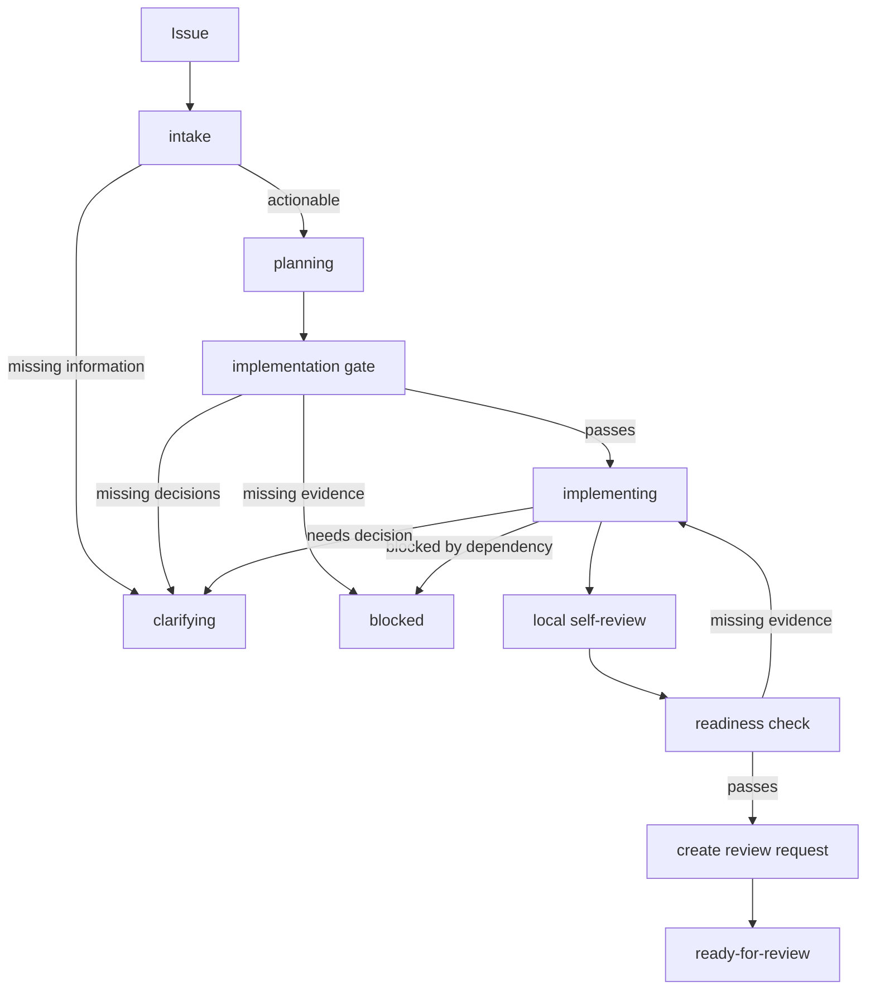

# GCW Executable Workflow Design

This document describes how GCW should evolve from a set of agent-facing workflow packages into an executable, verifiable, and recoverable workflow that can run locally or in GitHub/GitLab automation.

## Core Idea

GCW should be modeled as a state-machine workflow whose steps can be executed by different runners:

- A local coding agent working in an issue worktree.
- A GitHub Actions workflow.
- A GitLab CI workflow.

The runner may change, but the workflow semantics should not. Each step should use the same contract: stable inputs, explicit preconditions, declared side effects, machine-readable outputs, and a valid state transition.

```text
GCW = workflow state machine + step contracts + evidence files
```

GCW is not just a local skill collection, and it is not just a hosted CI workflow. Local Git helpers and hosted automation are execution environments for the same issue-backed workflow.

## Layering

GCW should keep three layers separate:

```text
GCW orchestration layer
  Decides which step is allowed next and what evidence is required.

Local Git execution layer
  Performs branch, worktree, commit, push, validation, and PR/MR creation operations.

Hosted collaboration layer
  Provides issues, progress comments, CI checks, review requests, and review support.
```

Local Git workflow packages should remain focused tools. They should not own GCW state-machine semantics. GitHub/GitLab workflows should act as runners and checkers, not as a second independent workflow definition.

## State Machine

GCW states and GCW steps are different concepts:

- A state is the stable stage recorded in `state.json` and the issue progress snapshot.
- A step is an executable workflow action that may validate evidence, write outputs, and perform an allowed transition.

The current v1 states are:

- `planning`
- `clarifying`
- `implementing`
- `blocked`
- `ready-for-review`

The current v1 steps are:

- `intake`
- `create-issue-worktree`
- `create-planning-files`
- `publish-planning`
- `implementation-gate`
- `implement`
- `local-self-review`
- `readiness-check`
- `create-review-request`

Recommended state flow:



A runner must not skip required evidence just because it can perform a later action. For example, creating a PR/MR without planning files, an implementation gate result, and readiness evidence is a normal Git operation, but it is not a GCW-ready review request.

`readiness-check` does not transition the issue to `ready-for-review`. It records that the branch has enough evidence to create or update a review request. `create-review-request` is the only v1 step that transitions an issue into `ready-for-review`, because the state means the review request exists and is prepared for code review.

V1 transition table:

| From state | Step | To state | Notes |
| --- | --- | --- | --- |
| none | `intake` | `planning` | The issue is actionable. |
| none | `intake` | `clarifying` | The issue lacks material information. |
| `planning` | `create-issue-worktree` | `planning` | Creates local isolation; hosted runners may only checkout. |
| `planning` | `create-planning-files` | `planning` | Creates human-readable planning files. |
| `planning` | `publish-planning` | `planning` | Pushes planning context and links the issue progress comment. |
| `planning` | `implementation-gate` | `implementing` | All implementation evidence is present. |
| `planning` | `implementation-gate` | `clarifying` | A required decision is missing. |
| `planning` | `implementation-gate` | `blocked` | Required evidence or external dependency is missing. |
| `implementing` | `implement` | `implementing` | Continues implementation and planning checkpoints. |
| `implementing` | `implement` | `clarifying` | A new material question appears. |
| `implementing` | `implement` | `blocked` | Implementation cannot continue safely. |
| `implementing` | `local-self-review` | `implementing` | Records pre-review-request inspection. |
| `implementing` | `readiness-check` | `implementing` | Records readiness evidence and allows `create-review-request`. |
| `implementing` | `create-review-request` | `ready-for-review` | Creates or updates the review request and records its URL. |

## Issue Directory

Each issue should have a durable directory under the issue branch:

```text
.gcw/issues/<issue-id>/
```

Human-readable working memory:

```text
.gcw/issues/<issue-id>/task_plan.md
.gcw/issues/<issue-id>/findings.md
.gcw/issues/<issue-id>/progress.md
```

Machine-readable workflow records:

```text
.gcw/issues/<issue-id>/state.json
.gcw/issues/<issue-id>/implementation_gate_result.json
.gcw/issues/<issue-id>/readiness_evidence.json
```

Step-specific files may be added as needed, but every file should have a clear owner and purpose.

## Human And Machine Records

Planning files are for humans and agents:

- `task_plan.md` explains the goal, phases, acceptance criteria, and validation plan.
- `findings.md` records issue facts, discoveries, decisions, risks, and open questions.
- `progress.md` records progress, commands run, errors, planning checkpoints, and local self-review.

JSON files are for workflow checks:

- `state.json` records current state, branch, owner, and allowed next steps.
- `implementation_gate_result.json` records whether implementation may begin.
- `readiness_evidence.json` records whether a review request is ready to create or update.

CI should not infer core workflow state from free-form Markdown when a JSON record can capture the same decision.

## State File

`state.json` is the canonical machine-readable snapshot claimed by the issue workflow. Validators must verify that claim against planning files, step evidence files, and hosted facts where available.

Example:

```json
{
  "issue": 42,
  "platform": "github",
  "repository": "owner/repo",
  "state": "implementing",
  "branch": "feat/example-42",
  "owner": {
    "kind": "local",
    "id": "cursor-session"
  },
  "last_completed_step": "implementation-gate",
  "next_allowed_steps": ["implement", "block", "clarify"],
  "evidence": {
    "planning_files_exist": true,
    "planning_commit_pushed": true,
    "progress_comment_url": "https://github.com/owner/repo/issues/42#issuecomment-...",
    "self_review_recorded": false,
    "review_request_url": ""
  }
}
```

The `owner` field is important when both local agents and hosted workflows can operate on the same issue. Only the current owner should perform write operations on the issue branch unless an explicit handoff occurs.

## V1 JSON Schemas

The v1 schemas are deliberately small. They describe the stable contract that local agents and hosted runners can generate and validate. Additional fields may be added later, but validators should fail when required v1 fields are missing, empty, or inconsistent with the allowed transition table.

The machine-readable v1 schema files live at:

```text
.agents/skills/gcw/schemas/state.schema.json
.agents/skills/gcw/schemas/implementation_gate_result.schema.json
.agents/skills/gcw/schemas/readiness_evidence.schema.json
```

### `state.json`

Purpose:
Record the current machine-readable workflow snapshot for one issue.

Required fields:

| Field | Type | Meaning |
| --- | --- | --- |
| `issue` | integer or string | Git hosting platform issue identifier. |
| `platform` | string | `github` or `gitlab`. |
| `repository` | string | Repository identifier, such as `owner/repo`. |
| `state` | string | One of `planning`, `clarifying`, `implementing`, `blocked`, `ready-for-review`. |
| `branch` | string | Issue branch name. |
| `owner.kind` | string | `local`, `github-actions`, `gitlab-ci`, or `manual`. |
| `owner.id` | string | Runner, session, user, or workflow identifier. |
| `last_completed_step` | string | Last successful v1 step, or an empty string before the first completed step. |
| `next_allowed_steps` | array of strings | Steps allowed from the current state. |
| `evidence.planning_files_exist` | boolean | Whether required planning files are present. |
| `evidence.planning_commit_pushed` | boolean | Whether the planning commit is available on the issue branch. |
| `evidence.progress_comment_url` | string | URL for the issue progress comment, or an empty string before publication. |
| `evidence.self_review_recorded` | boolean | Whether local self-review has been recorded. |
| `evidence.review_request_url` | string | Review request URL, or an empty string before creation. |

Consistency rules:

- `state` must be a v1 state.
- `next_allowed_steps` must be compatible with the transition table.
- `ready-for-review` requires a non-empty `evidence.review_request_url`.
- `implementing` requires a passing `implementation_gate_result.json`.
- `owner.kind` controls which runner may perform write operations.

### `implementation_gate_result.json`

Purpose:
Record whether implementation may begin or why it must pause.

Required fields:

| Field | Type | Meaning |
| --- | --- | --- |
| `step` | string | Must be `implementation-gate`. |
| `ok` | boolean | Whether implementation may begin. |
| `state_transition.from` | string | Source state, normally `planning`. |
| `state_transition.to` | string | `implementing`, `clarifying`, or `blocked`. |
| `checks.planning_files_exist` | boolean | Required planning files exist under the issue directory. |
| `checks.planning_commit_pushed` | boolean | Planning commit is pushed to the issue branch. |
| `checks.progress_comment_linked` | boolean | Issue progress comment links to branch versions of planning files. |
| `checks.issue_actionable` | boolean | The issue has enough information to implement safely. |
| `errors` | array of strings | Empty when `ok` is true; blocker details when false. |

Consistency rules:

- `ok: true` requires `state_transition.to` to be `implementing`.
- `ok: false` requires `state_transition.to` to be `clarifying` or `blocked`.
- A passing gate requires all checks to be true.
- A passing gate must agree with `state.json.evidence`.

### `readiness_evidence.json`

Purpose:
Record whether the branch has enough evidence to create or update a complete-on-create review request.

Required fields:

| Field | Type | Meaning |
| --- | --- | --- |
| `issue` | integer or string | Linked issue identifier. |
| `branch` | string | Issue branch name. |
| `base_branch` | string | Target branch for the review request. |
| `commit_range` | string | Intended diff range for review, such as `main...branch`. |
| `review_request.title` | string | Proposed review request title. |
| `review_request.summary` | string | Concise implementation summary. |
| `review_request.issue_link` | string | Closing or reference keyword, such as `Closes #42`. |
| `validation` | array of objects | Commands or checks run, each with result details. |
| `local_self_review.recorded` | boolean | Whether local self-review was recorded. |
| `local_self_review.progress_section` | string | Heading or marker in `progress.md` containing the self-review. |
| `planning_links.task_plan` | string | Branch URL for `task_plan.md`. |
| `planning_links.findings` | string | Branch URL for `findings.md`. |
| `planning_links.progress` | string | Branch URL for `progress.md`. |
| `progress_comment_url` | string | URL for the issue progress comment. |
| `risks` | string | Known risks or reviewer notes. |

Consistency rules:

- `readiness_evidence.json` does not by itself move `state.json.state` to `ready-for-review`.
- Passing readiness requires a passing implementation gate.
- `local_self_review.progress_section` must exist in `progress.md`.
- Planning links should point to branch versions, not fixed commit URLs.
- `review_request.issue_link`, validation, risks, planning links, and progress comment URL should be usable directly in the review request body.

## Step Contract

Every executable GCW step should define the same fields:

```text
name
purpose
input files
preconditions
actions
side effects
output files
state transition
failure result
runner support
```

Example:

```text
Step: implementation-gate

Purpose:
  Decide whether implementation may begin.

Inputs:
  .gcw/issues/<issue-id>/state.json
  .gcw/issues/<issue-id>/task_plan.md
  .gcw/issues/<issue-id>/findings.md
  .gcw/issues/<issue-id>/progress.md
  hosted issue progress comment

Preconditions:
  Issue branch exists.
  Planning files exist.
  Planning commit has been pushed.

Actions:
  Check planning file presence.
  Check remote planning links.
  Check issue is still actionable.
  Check progress status.

Outputs:
  .gcw/issues/<issue-id>/implementation_gate_result.json
  updated .gcw/issues/<issue-id>/state.json

State transition:
  planning -> implementing
  planning -> clarifying
  planning -> blocked

Failure result:
  No implementation changes are allowed.
```

## Check And Apply Modes

Each step should support two conceptual modes:

```text
check
  Validate preconditions and evidence without mutating remote state.

apply
  Perform the allowed state transition or side effect after checks pass.
```

Examples:

- `gcw_step.py implementation-gate --mode check` validates a recorded gate result.
- `gcw_step.py implementation-gate --mode apply` records the gate result and updates state.
- `gcw_step.py readiness-check --mode check` verifies the branch is ready for PR/MR creation.
- `gcw_step.py create-review-request --mode check` verifies readiness before PR/MR creation.
- `gcw_step.py create-review-request --mode apply` records the review request URL after the PR/MR exists.

Hosted CI should prefer `check` mode for pull request validation. State-changing workflows should use `apply` mode only after the relevant checks pass.

## Recommended Steps

### `intake`

Purpose:
Read the issue, comments, labels, and assignees, then decide whether the issue is actionable.

Typical runner:
Local agent or hosted workflow.

Outputs:

```text
.gcw/issues/<issue-id>/state.json
```

Allowed transitions:

```text
Issue -> planning
Issue -> clarifying
```

### `create-issue-worktree`

Purpose:
Create the issue branch and isolated issue worktree.

Typical runner:
Local agent. Hosted workflows may checkout the branch, but should not create a developer's local worktree.

Outputs:

```text
branch: <type>/<short-desc>-<issue-id>
worktree: .worktrees/<branch>
```

Allowed transition:

```text
planning -> planning
```

### `create-planning-files`

Purpose:
Create the human-readable planning files for the issue.

Typical runner:
Local agent or hosted workflow.

Outputs:

```text
.gcw/issues/<issue-id>/task_plan.md
.gcw/issues/<issue-id>/findings.md
.gcw/issues/<issue-id>/progress.md
```

Allowed transition:

```text
planning -> planning
```

### `publish-planning`

Purpose:
Commit and push planning files, then link them from the issue progress comment.

Typical runner:
Local agent or hosted workflow with write permission.

Outputs:

```text
Planning commit
Issue progress comment with <!-- gcw-progress -->
Updated state.json evidence
```

Allowed transition:

```text
planning -> planning
```

### `implementation-gate`

Purpose:
Verify that implementation may begin.

Typical runner:
Local agent or CI.

Outputs:

```text
.gcw/issues/<issue-id>/implementation_gate_result.json
Updated state.json
```

Allowed transitions:

```text
planning -> implementing
planning -> clarifying
planning -> blocked
```

### `implement`

Purpose:
Make implementation changes according to the issue and planning files.

Typical runner:
Local agent first. Hosted automation can be added later, but it must respect ownership and state.

Outputs:

```text
Implementation diff
Focused commits
Updated planning files
Updated progress.md
```

Allowed transitions:

```text
implementing -> implementing
implementing -> clarifying
implementing -> blocked
```

### `local-self-review`

Purpose:
Inspect the branch before review request creation.

Typical runner:
Local agent. CI can verify that the result exists.

Required record in `progress.md`:

```text
Diff reviewed
Validation performed
Planning state checked
Commit boundaries checked
Risks and reviewer notes recorded
```

Allowed transition:

```text
implementing -> implementing
```

### `readiness-check`

Purpose:
Verify that the branch has enough evidence to create or update a complete-on-create review request.

Typical runner:
Local agent or CI.

Outputs:

```text
.gcw/issues/<issue-id>/readiness_evidence.json
Updated state.json
```

Allowed transitions:

```text
implementing -> implementing
```

Passing this check allows `create-review-request` to run next. It does not set `ready-for-review`.
Any `state.json` update from this step is limited to evidence fields, `last_completed_step`, and `next_allowed_steps`; `state` remains `implementing`.

### `create-review-request`

Purpose:
Create or update the GitHub Pull Request or GitLab Merge Request.

Typical runner:
Local agent or hosted workflow with write permission.

Inputs:

```text
readiness_evidence.json
planning file links
progress comment URL
branch and base branch
```

Outputs:

```text
Review request URL
Updated issue progress comment
Updated state.json
```

Allowed transition:

```text
implementing -> ready-for-review
```

This is the only v1 transition into `ready-for-review`.

## CI Responsibilities

CI should check whether the workflow evidence is valid. CI should not become a second source of product decisions.

Good CI responsibilities:

- Validate `state.json` state and transition consistency.
- Validate required planning files exist.
- Validate implementation gate result.
- Validate local self-review was recorded.
- Validate readiness evidence.
- Validate PR/MR body includes issue link, validation, risks, and planning links.
- Run repository tests and static checks.
- Detect conflict markers, obvious generated churn, and missing required evidence.

Bad CI responsibilities:

- Decide product scope without human or issue evidence.
- Invent missing requirements.
- Override the current issue branch owner.
- Force-push or rewrite branch history.
- Create a review request when readiness checks fail.

## Runner Permission Matrix

The same step contract can run in multiple places, but each runner has different authority. V1 treats GitHub Actions as a checker by default. Hosted apply mode is allowed only after ownership and write permission are explicit.

| Capability | Local owning agent | GitHub Actions check | GitHub Actions apply |
| --- | --- | --- | --- |
| Read issue directory and planning files | yes | yes | yes |
| Run deterministic validators | yes | yes | yes |
| Create or edit local planning files | yes | no | yes, only when `owner.kind` is `github-actions` |
| Commit or push branch changes | yes | no | yes, only when `owner.kind` is `github-actions` |
| Update `state.json` | yes | no | yes, only for allowed transitions |
| Write `implementation_gate_result.json` | yes | no | yes, after checks pass or record blockers |
| Write `readiness_evidence.json` | yes | no | yes, after self-review evidence exists |
| Update issue progress comment | yes | no | yes, only when the workflow owns the comment |
| Create or update review request | yes | no | yes, only after readiness passes |
| Override branch owner | no | no | no, requires explicit handoff |
| Force-push, delete branch, merge, or close issue | no, unless explicitly approved | no | no |

Runner rules:

- Local owning agents may perform check and apply steps inside the issue worktree.
- GitHub Actions check mode must not mutate repository, issue, or review request state.
- GitHub Actions apply mode must fail closed unless `state.json.owner.kind` is `github-actions` or an explicit ownership handoff has been recorded.
- GitLab CI apply mode must fail closed unless `state.json.owner.kind` is `gitlab-ci` or an explicit ownership handoff has been recorded.
- Non-owner runners may report blockers, but they must not push implementation changes.

## Local And Hosted Execution

The same step should be runnable locally and in hosted automation:

```text
Local:
  Agent reads the issue, edits files, runs checks, and updates state files.

GitHub Actions or GitLab CI:
  Workflow checks out the branch, runs the same checks, updates allowed outputs, and posts status.
```

Implementation should avoid two separate logic paths. Shared helper scripts should own the deterministic checks wherever possible, and both local agents and hosted workflows should call those scripts.

## Ownership And Handoff

When both local agents and hosted workflows can write, ownership must be explicit.

Recommended owner kinds:

```text
local
github-actions
gitlab-ci
manual
```

Rules:

- Only the current owner may push implementation changes to the issue branch.
- A non-owner runner may run checks and report blockers.
- Ownership handoff must update `state.json` and the issue progress comment.
- If ownership is unclear, hosted automation should fail closed and avoid branch writes.

This prevents local work and hosted automation from pushing conflicting changes to the same issue branch.

## Minimal First Implementation

The first implementation should avoid automating everything. Start by making the workflow checkable.

Recommended first slice:

1. Define `state.json`.
2. Define `implementation_gate_result.json`.
3. Define `readiness_evidence.json`.
4. Add state-machine checks that validate the transition table.
5. Add evidence checks that validate planning files, progress comment links, local self-review, and readiness evidence.
6. Make `pr-create` treat GCW branches specially when `.gcw/issues/<issue-id>/` exists.

The first shared checker lives at:

```text
.agents/skills/gcw/scripts/validate_gcw_evidence.py
```

It currently supports:

```bash
python3 .agents/skills/gcw/scripts/validate_gcw_evidence.py state --issue-dir .gcw/issues/<issue-id>
python3 .agents/skills/gcw/scripts/validate_gcw_evidence.py implementation-gate --issue-dir .gcw/issues/<issue-id>
python3 .agents/skills/gcw/scripts/validate_gcw_evidence.py readiness-check --issue-dir .gcw/issues/<issue-id>
```

The first unified step runner lives at:

```text
.agents/skills/gcw/scripts/gcw_step.py
```

It dispatches `check` mode to deterministic validators and `apply` mode to the local state manager:

```bash
python3 .agents/skills/gcw/scripts/gcw_step.py state --mode check --issue-dir .gcw/issues/<issue-id>
python3 .agents/skills/gcw/scripts/gcw_step.py implementation-gate --mode apply --runner-kind local --issue-dir .gcw/issues/<issue-id> --progress-comment-url <issue-progress-comment-url>
python3 .agents/skills/gcw/scripts/gcw_step.py readiness-check --mode check --issue-dir .gcw/issues/<issue-id>
python3 .agents/skills/gcw/scripts/gcw_step.py create-review-request --mode apply --runner-kind local --issue-dir .gcw/issues/<issue-id> --review-request-url <review-request-url>
python3 .agents/skills/gcw/scripts/gcw_step.py remote-progress-comment --mode check --issue-dir .gcw/issues/<issue-id> --remote-file /tmp/progress-comment.md
python3 .agents/skills/gcw/scripts/gcw_step.py remote-review-request --mode check --issue-dir .gcw/issues/<issue-id> --remote-file /tmp/review-request.md
```

`apply` mode requires owner alignment. The runner defaults to `local`; hosted runners pass `--runner-kind github-actions` or `--runner-kind gitlab-ci`. If `state.json.owner.kind` does not match, the step fails closed before writing state files or hosted artifacts.

Remote artifact checks use fetched hosted text as input. Fetching may happen through `gh`, `glab`, curl, or another platform client, but the comparison is deterministic and local:

```bash
python3 .agents/skills/gcw/scripts/verify_gcw_remote_evidence.py progress-comment --issue-dir .gcw/issues/<issue-id> --remote-file /tmp/progress-comment.md
python3 .agents/skills/gcw/scripts/verify_gcw_remote_evidence.py review-request --issue-dir .gcw/issues/<issue-id> --remote-file /tmp/review-request.md
```

Hosted workflows render update bodies from local evidence before mutating issue comments or review request descriptions:

```bash
python3 .agents/skills/gcw/scripts/render_gcw_hosted_artifacts.py progress-comment --issue-dir .gcw/issues/<issue-id>
python3 .agents/skills/gcw/scripts/render_gcw_hosted_artifacts.py review-request --issue-dir .gcw/issues/<issue-id>
```

The first helper for writing v1 records lives at:

```text
.agents/skills/gcw/scripts/manage_gcw_state.py
```

It currently supports:

```bash
python3 .agents/skills/gcw/scripts/manage_gcw_state.py init-state --issue-dir .gcw/issues/<issue-id> --issue <issue-id> --platform <github|gitlab> --repository <owner/repo> --branch <branch> --owner-kind local --owner-id <agent-session-id>
python3 .agents/skills/gcw/scripts/manage_gcw_state.py record-publish-planning --issue-dir .gcw/issues/<issue-id> --progress-comment-url <issue-progress-comment-url>
python3 .agents/skills/gcw/scripts/manage_gcw_state.py record-implementation-gate --issue-dir .gcw/issues/<issue-id> --progress-comment-url <issue-progress-comment-url> --issue-actionable <true|false> --clarifying-question <question-if-needed>
python3 .agents/skills/gcw/scripts/manage_gcw_state.py record-block --issue-dir .gcw/issues/<issue-id> --reason <blocker-summary>
python3 .agents/skills/gcw/scripts/manage_gcw_state.py record-clarify --issue-dir .gcw/issues/<issue-id> --question <clarifying-question>
python3 .agents/skills/gcw/scripts/manage_gcw_state.py record-local-self-review --issue-dir .gcw/issues/<issue-id> --progress-section "## Local Self-Review"
python3 .agents/skills/gcw/scripts/manage_gcw_state.py record-readiness-evidence --issue-dir .gcw/issues/<issue-id> --base-branch <base-branch> --commit-range <base-branch>...<branch> --title <review-request-title> --summary <summary> --issue-link "Closes #<issue-id>" --validation-command <validation-command> --validation-result <passed|failed|skipped> --risks <risks-or-reviewer-notes>
python3 .agents/skills/gcw/scripts/manage_gcw_state.py record-review-request --issue-dir .gcw/issues/<issue-id> --review-request-url <review-request-url>
python3 .agents/skills/gcw/scripts/manage_gcw_state.py record-handoff --issue-dir .gcw/issues/<issue-id> --owner-kind <local|github-actions|gitlab-ci|manual> --owner-id <runner-or-session-id> --reason <handoff-reason>
```

The first hosted check workflows live at:

```text
.github/workflows/ci.yml
.gitlab-ci.yml
.gitlab/ci/gcw-validate.yml
```

They run in read-only check mode. They validate `state.json` for each `.gcw/issues/<issue-id>/` directory, then validate implementation gate and readiness evidence only when those files or states are present. They also parse the v1 JSON Schema files and run unit tests against a checked-in complete evidence fixture at `.agents/skills/gcw/tests/fixtures/complete_issue/`.

The first hosted apply entry points live at:

```text
.github/workflows/gcw-hosted-apply.yml
.gitlab/ci/gcw-hosted-apply.yml
```

They are manually triggered and owner-gated. When the hosted runner owns the issue branch, they can apply state transitions, render the issue progress comment and review request body, update hosted artifacts, commit changed `.gcw/issues/<issue-id>/` evidence, and push the branch. They do not force-push, delete branches, merge review requests, or close issues.

After that is stable, hosted workflows can progressively execute more steps:

```text
Phase 1:
  CI checks evidence.

Phase 2:
  Hosted workflow can apply state transitions.

Phase 3:
  A cloud coding agent can implement or fix code with explicit branch ownership.
```

Phase 3 requires a real cloud coding agent or `/fix` execution primitive. This repository now exposes the ownership handoff, hosted apply, artifact rendering, and validation contracts that such a runner must use, but it does not invent an autonomous code-modifying runner when no platform primitive is configured.

## Summary

The intended design is:

```text
Issue defines the work.
Planning files preserve the reasoning.
State files make the workflow checkable.
Local Git performs implementation safely.
Hosted CI validates evidence and state.
Review requests are created only when readiness evidence passes.
Ready for review is reached only after the review request exists.
```

This keeps local development and GitHub/GitLab automation aligned without creating two competing workflows.
