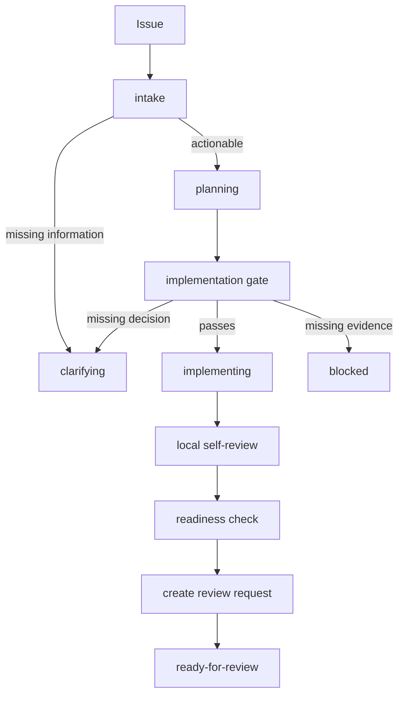

# GCW 工作流

GCW 是一个带共享 step contract 的状态机工作流。本地 agent 和 hosted runner 可以执行相同的确定性检查，但只有当前 owner 可以 apply 写入型 transition。

## 状态

v1 GCW 状态包括：

- `planning`
- `clarifying`
- `implementing`
- `blocked`
- `ready-for-review`

## 步骤

v1 步骤包括：

- `intake`
- `create-issue-worktree`
- `create-planning-files`
- `publish-planning`
- `implementation-gate`
- `implement`
- `local-self-review`
- `readiness-check`
- `create-review-request`

## 推荐流程



`readiness-check` 记录分支已经具备创建或更新 review request 的证据。它不会把 Issue 移到 `ready-for-review`。只有 `create-review-request` 会这样做，因为该状态表示托管 review request 已存在并准备好 code review。

## Step Runner

支持的步骤优先使用统一 step runner：

```bash
python3 .agents/skills/gcw/scripts/gcw_step.py state --mode check --issue-dir .gcw/issues/<issue-id>
python3 .agents/skills/gcw/scripts/gcw_step.py readiness-check --mode check --issue-dir .gcw/issues/<issue-id>
python3 .agents/skills/gcw/scripts/gcw_step.py implementation-gate --mode apply --runner-kind local --issue-dir .gcw/issues/<issue-id> --progress-comment-url <issue-progress-comment-url>
```

Apply mode 受 ownership gate 保护。Hosted runner 传入 `--runner-kind github-actions` 或 `--runner-kind gitlab-ci`；本地 agent 使用默认值 `local`。
