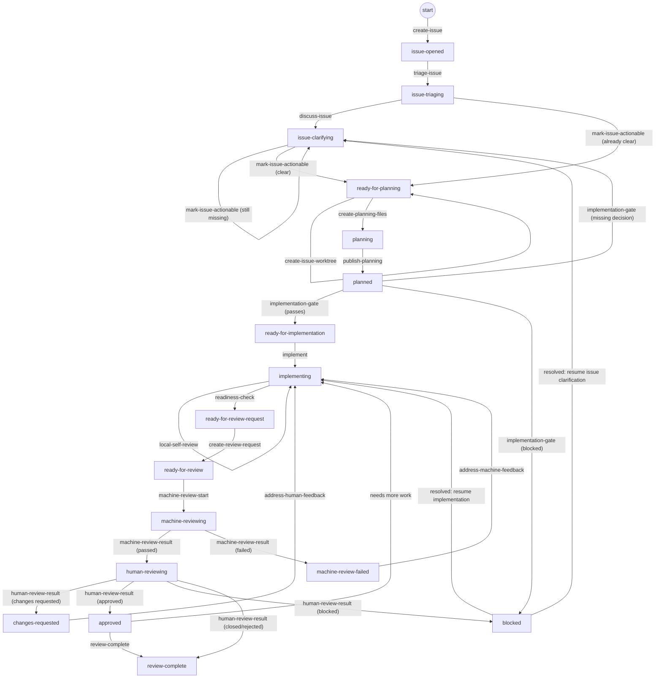

# GCW 工作流

GCW 的完整流程从 Issue 提出开始，不是从写代码开始。一个 Issue 需要先创建、分类、讨论清楚，并被判断为可以开发，之后才进入 planning files、实现、review request、机审、人审和审查结束。

本文把三个层次拆开说明：

- **步骤**：agent、Action 或人可以执行的具体动作。
- **状态**：`state.json` 和 progress snapshot 中记录的稳定阶段。
- **Action 流水线**：可以合并到同一个自动化入口中连续执行的步骤组。

## 主流程

```text
创建 Issue
  -> Issue 分类
  -> Issue 评论和讨论
  -> 判断 Issue 已经清楚、可以规划
  -> 创建 planning files
  -> 提交并推送 planning files
  -> 在 Issue 评论中链接 planning files
  -> 开发
  -> 自查和 readiness check
  -> 创建 review request
  -> PR/MR 机审
  -> 人类审查
  -> 审查结束
```

planning files 不是直接上传到 Issue。它们会提交到 Issue 分支中的 `.gcw/issues/<issue-id>/`，推送到远程分支，然后通过 Issue 评论链接到这些文件。

## 步骤拆解

| 顺序 | 步骤 | 目标 | 完成后的状态 | 可放入 Action |
| --- | --- | --- | --- | --- |
| 1 | `create-issue` | 创建 GitHub/GitLab Issue，写清背景、目标、期望结果和已知约束。 | `issue-opened` | 可以；也可以由人手动创建 |
| 2 | `triage-issue` | 分类 Issue，判断类型、优先级、影响范围、是否重复，并补充 labels 或 metadata。 | `issue-triaging` | 是 |
| 3 | `discuss-issue` | 通过 Issue 评论补充信息、确认边界、澄清验收标准和风险。 | `issue-clarifying` | 部分可以；关键答案必须来自人或可信来源 |
| 4 | `mark-issue-actionable` | 判断 Issue 是否已经讨论清楚，能否安全进入开发规划。 | `ready-for-planning` 或 `issue-clarifying` | 是 |
| 5 | `create-issue-worktree` | 为 Issue 创建隔离 worktree，避免污染当前工作区。 | `ready-for-planning` | 是 |
| 6 | `create-planning-files` | 创建 `.gcw/issues/<issue-id>/` 下的 `task_plan.md`、`findings.md`、`progress.md`。 | `planning` | 是 |
| 7 | `publish-planning` | 提交并推送 planning files，并在 Issue 评论中链接这些文件。 | `planned` | 是 |
| 8 | `implementation-gate` | 检查 Issue 是否 actionable、planning files 是否已推送、Issue 评论是否已链接规划文件。 | `ready-for-implementation`、`issue-clarifying` 或 `blocked` | 是 |
| 9 | `implement` | 按计划修改代码、补测试、更新必要文档。 | `implementing` | 可以，但需要 agent 具备代码能力 |
| 10 | `local-self-review` | 创建 review request 前检查 diff、提交边界、风险、验证结果和 planning files。 | `implementing` | 是 |
| 11 | `readiness-check` | 生成或验证 readiness evidence，确认分支具备创建 review request 的条件。 | `ready-for-review-request` | 是 |
| 12 | `create-review-request` | 创建或更新 GitHub Pull Request / GitLab Merge Request，并写入完整 summary、Issue link、验证结果和风险说明。 | `ready-for-review` | 是 |
| 13 | `machine-review-start` | 触发 CI、静态检查、remote artifact verification、可选 AI review。 | `machine-reviewing` | 是 |
| 14 | `machine-review-result` | 汇总机审结果；通过则进入人审，失败则回到修复流程。 | `human-reviewing` 或 `machine-review-failed` | 是 |
| 15 | `address-machine-feedback` | 根据 CI、静态检查或 AI review 的问题修复代码，并重新更新 review request。 | `implementing` | 可以，但需要 agent 具备代码能力 |
| 16 | `human-review-result` | 记录人类 reviewer 的结论：通过、要求修改、阻塞、关闭或拒绝。 | `approved`、`changes-requested`、`blocked` 或 `review-complete` | 部分可以 |
| 17 | `address-human-feedback` | 根据人审意见修复代码，并回到自查、readiness check、更新 review request、机审流程。 | `implementing` | 可以，但需要 agent 具备代码能力 |
| 18 | `review-complete` | 记录审查结束结果，例如已批准、已合并、已关闭、拒绝或明确不再继续。 | `review-complete` | 是；合并或关闭必须有人类授权 |

## 状态拆解

| 状态 | 含义 | 允许的典型下一步 |
| --- | --- | --- |
| `issue-opened` | Issue 已创建，但还没有完成分类和可执行性判断。 | `triage-issue` |
| `issue-triaging` | 正在判断 Issue 类型、优先级、影响范围、重复关系和初始标签。 | `discuss-issue` 或 `mark-issue-actionable` |
| `issue-clarifying` | Issue 信息不足或边界不清，需要通过评论继续讨论。 | `discuss-issue`、`mark-issue-actionable` |
| `ready-for-planning` | Issue 已经讨论清楚，可以开始创建 worktree 和 planning files。 | `create-issue-worktree`、`create-planning-files` |
| `planning` | 正在创建或更新 planning files。 | `publish-planning` |
| `planned` | planning files 已提交并推送，Issue 评论已经链接到远程文件。 | `implementation-gate` |
| `ready-for-implementation` | 实现前检查通过，可以开始开发。 | `implement` |
| `implementing` | agent 正在实现功能、修复问题、补测试，或处理机审/人审反馈。 | `implement`、`local-self-review`、`readiness-check`、`block`、`clarify` |
| `ready-for-review-request` | 分支已经具备创建或更新 review request 的证据。 | `create-review-request` |
| `ready-for-review` | review request 已创建或更新，并包含代码审查所需的信息。它不是终点，只表示可以进入机审。 | `machine-review-start` |
| `machine-reviewing` | CI、静态检查、remote artifact verification 或 AI review 正在运行。 | `machine-review-result` |
| `machine-review-failed` | 机审发现失败项或高风险问题，需要 agent 修复或人类裁决。 | `address-machine-feedback`、`block`、`clarify` |
| `human-reviewing` | 机审已经通过或被人类接受，正在等待 reviewer 审查。 | `human-review-result` |
| `changes-requested` | reviewer 要求修改。agent 需要回到实现流程并更新 review request。 | `address-human-feedback` |
| `approved` | reviewer 已批准。是否合并、关闭 Issue 或继续发布，仍受项目策略和人类授权控制。 | `review-complete`，或在需要额外处理时回到 `implementing` |
| `blocked` | 当前无法继续推进，例如缺权限、缺依赖、外部服务不可用或需要人类决策。 | 阻塞解除后回到对应阶段 |
| `review-complete` | 人类审查已经结束，结果已记录。这个状态可以代表已合并、已关闭、已接受不合并、拒绝，或明确终止。 | 无 |

`ready-for-review` 只说明 review request 已经准备好进入审查。真正的闭环终点是 `review-complete`。

## 推荐流程



图为主推荐流程。`block` 和 `clarify` 是大多数工作状态都可触发的逃逸转换（详见状态拆解表）：触发后分别进入 `blocked` 或 `issue-clarifying`，为保持可读性未在每个状态重复绘制。

## Action 流水线边界

| Action 流水线 | 可合并步骤 | 适合自动化的原因 | 边界 |
| --- | --- | --- | --- |
| `gcw-issue-intake` | `create-issue`、`triage-issue`、初步评论 | Issue 创建和分类可以标准化，适合自动补 labels、metadata 和初始问题。 | 不应替人决定不明确的需求；复杂需求应进入 `issue-clarifying`。 |
| `gcw-issue-clarify` | `discuss-issue`、`mark-issue-actionable` | 可以检测缺失信息、生成澄清问题、在信息齐全后标记为 `ready-for-planning`。 | 关键业务决策必须来自人类或可信来源，不能由 Action 猜测。 |
| `gcw-planning` | `create-issue-worktree`、`create-planning-files`、`publish-planning` | Issue 已清楚后，创建 planning files、提交、推送和更新 Issue 评论都是可自动化的准备工作。 | 只能从 `ready-for-planning` 开始；planning files 必须推送到分支并从 Issue 评论链接。 |
| `gcw-implement` | `implementation-gate`、`implement`、`local-self-review`、`readiness-check` | 具备代码能力的 agent 可以连续完成实现、自查和 readiness evidence。 | 普通 CI 不应自行改代码；需要明确 owner 和分支写权限。 |
| `gcw-review-request` | `create-review-request`、更新 issue progress comment、更新 review request body | 基于 readiness evidence 可以确定性生成 review request 内容。 | 不应跳过 local self-review 和 readiness-check。 |
| `gcw-machine-review` | `machine-review-start`、CI、静态检查、remote artifact verification、`machine-review-result` | PR/MR 创建或更新后可以由 Action 自动运行，并把结果写回状态。 | 自动检查失败时只能进入 `machine-review-failed`，不能直接合并或关闭。 |
| `gcw-feedback-loop` | `address-machine-feedback` 或 `address-human-feedback`，然后回到 `local-self-review`、`readiness-check`、更新 review request | 反馈修复和重新验证可以由 agent 连续执行。 | 必须保留 reviewer 意见和修复摘要；高风险操作仍需人类批准。 |
| `gcw-review-complete` | 记录 `approved`、merge/close 结果、更新 issue progress comment、进入 `review-complete` | 审查结束后的记录可以自动化，保证 Issue 与 review request 状态一致。 | merge、close issue、删除分支等操作必须先获得明确的人类授权。 |

理论上，一个具备完整权限和代码能力的 agent 可以按顺序跑完整流程；工程上更推荐拆成上述 Action 流水线，因为每段的权限边界、失败恢复方式和人类参与点不同。

## Step Runner

支持的步骤优先通过统一的 step runner 执行：

```bash
python3 .agents/skills/gcw/scripts/gcw_step.py state --mode check --issue-dir .gcw/issues/<issue-id>
python3 .agents/skills/gcw/scripts/gcw_step.py readiness-check --mode check --issue-dir .gcw/issues/<issue-id>
python3 .agents/skills/gcw/scripts/gcw_step.py implementation-gate --mode apply --runner-kind local --issue-dir .gcw/issues/<issue-id> --progress-comment-url <issue-progress-comment-url>
```

Apply mode 是会写入状态或更新远程内容的执行模式，受 ownership gate 保护。Hosted runner 需要传入 `--runner-kind github-actions` 或 `--runner-kind gitlab-ci`；本地 agent 使用默认值 `local`。
